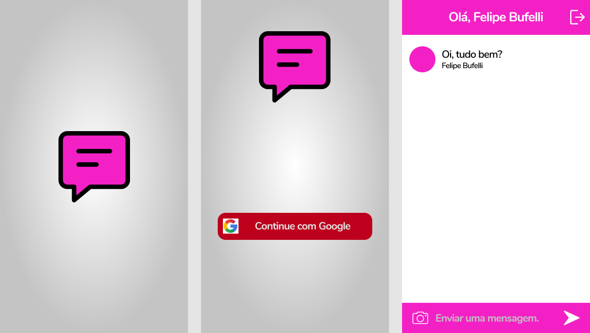

# Chat Real-time with Flutter

---

Chat Real-time developed in flutter. Inspired by application #7 of Daniel Ciolfi's course.

 

## Features

- **Flutter** -  A framework developed by Google in the Dart language.
- **Firebase**- A mobile app development platform that provides data analysis and database web services for developers.

## Getting Started

1. Clone this repo using `git clone https://github.com/felipebufelli/chat_real_time.git`
2. Move yourself to the appropriate directory: `cd chat_real_time`
3. Run `flutter run` to start the mobile app.

Note: If you choose to start the mobile app in the android emulator, you will have to start the emulator before.
